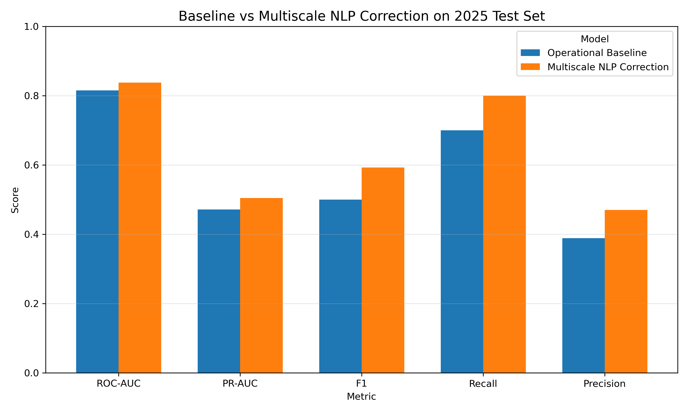
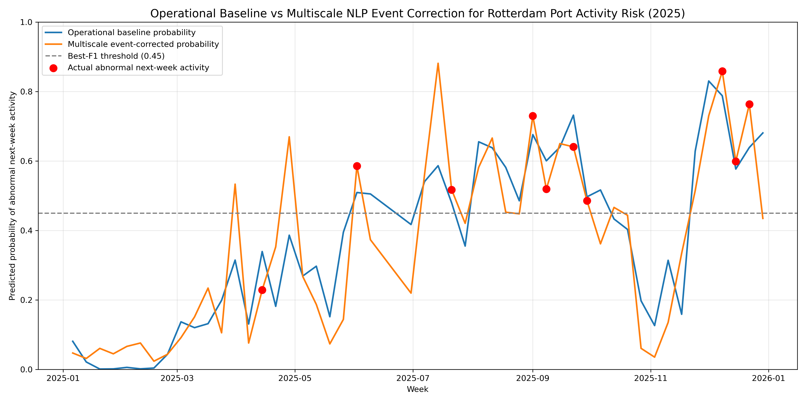

# Event-Augmented Port Disruption Prediction Using Multiscale News NLP

This project tests whether news-derived event signals can improve the prediction of abnormal port activity beyond a historical operational baseline.

The empirical setting is the Port of Rotterdam. Historical weekly port activity is combined with GDELT-derived maritime news signals. The key idea is not to treat news as a single global signal, but to integrate event information across global, regional, and local layers.

## Research Question

Can NLP-derived external event signals improve the prediction of abnormal next-week port activity when they are used as a spatially layered correction mechanism on top of an operational baseline?

## Key Finding

Simple global news signals are unstable. However, when NLP-derived event signals are spatially layered across global, Europe-level, and local Netherlands/Rotterdam-oriented signals, they improve the operational baseline on the 2025 test set.

At the default threshold, the multiscale NLP correction improves all main metrics:

| Model | ROC-AUC | PR-AUC | F1 | Recall | Precision |
|---|---:|---:|---:|---:|---:|
| Operational baseline | 0.815 | 0.471 | 0.500 | 0.700 | 0.389 |
| Multiscale NLP correction | 0.838 | 0.505 | 0.593 | 0.800 | 0.471 |

At the best-F1 threshold, the multiscale model also outperforms the baseline:

| Model | Best F1 | Recall | Precision |
|---|---:|---:|---:|
| Operational baseline | 0.581 | 0.900 | 0.429 |
| Multiscale NLP correction | 0.600 | 0.900 | 0.450 |

## Main Figures





## Data Sources

This project uses two public data sources:

- **IMF PortWatch**: weekly port activity indicators for Rotterdam, derived from daily PortWatch records.
- **GDELT Event Database**: global news event records. `SOURCEURL` slugs are used as lightweight textual representations of maritime news articles.

Large raw and intermediate data files are not intended to be committed to GitHub. The repository keeps code, notebooks, documentation, final figures, and small summary CSV files needed to reproduce the final result tables. A full reproduction script is provided for users who want to rebuild the dataset from public sources.

Detailed NLP filtering, weak-labeling, spatial-layer construction, and feature aggregation rules are documented in `docs/NLP_SIGNAL_CONSTRUCTION.md`. The executable implementation is provided in `scripts/reproduce_pipeline.py`.

## Methodology

The project uses a weekly temporal prediction design. The task is to predict whether Rotterdam port activity in the next week will be abnormally low relative to its recent historical level.

### 1. Target construction

Daily PortWatch records are aggregated to weekly port activity. The main activity variable is weekly `portcalls`, which counts vessel calls at the port. The binary target is denoted as \(y_{t+1}\), where \(y_{t+1}=1\) if next-week port activity falls below the rolling historical abnormality threshold, and \(y_{t+1}=0\) otherwise.

In this MVP, abnormality is treated as a statistical proxy for disruption rather than an official disruption label. This makes the project suitable for testing whether external event signals contain predictive information, while keeping the limitation explicit.

### 2. Operational baseline model

The baseline model uses only historical port activity information. Features include:

- lagged weekly activity: `lag_activity_1w`, `lag_activity_2w`, `lag_activity_4w`;
- rolling activity level: `rolling_mean_4w`, `rolling_mean_8w`;
- rolling volatility: `rolling_std_4w`, `rolling_std_8w`;
- recent activity change: `rolling_change_4w`;
- calendar variables: `month`, `quarter`.

A Logistic Regression classifier is used as the main baseline because it is transparent, stable on a small weekly dataset, and produces interpretable risk probabilities.

### 3. News NLP signal extraction

GDELT event records are filtered to maritime and logistics-related news using URL-based keyword screening. Because full article text is not redistributed, the project uses the textual slug from `SOURCEURL` as a lightweight text representation.

A weakly supervised TF-IDF Logistic Regression model is trained on January 2024 maritime news slugs. The weak labels are created from transparent rules using event severity, tone, and disruption-related terms. The trained classifier then estimates an article-level disruption probability:

\(p_i^{NLP} = P(\text{disruption-related maritime news} \mid \text{URL slug text}_i)\), where \(p_i^{NLP}\) is the predicted disruption probability for article \(i\).

This step does not claim to build a perfect NLP model. Its purpose is to convert unstructured news traces into consistent event-risk features that can be tested against the operational baseline.

The filtering and labeling logic is intentionally transparent and reproducible. In brief, the pipeline:

- filters GDELT records using maritime keywords such as `port`, `shipping`, `cargo`, `container`, `vessel`, `tanker`, `terminal`, `freight`, `suez`, `panama`, `red sea`, `houthi`, and `maersk`;
- extracts text from the URL path in `SOURCEURL`;
- creates weak labels using event severity, negative tone, and disruption-related keywords;
- trains a TF-IDF Logistic Regression classifier on the weakly labeled January 2024 maritime article set;
- applies the classifier to 2021-2025 maritime news records to obtain article-level disruption probabilities.

### 4. Weekly event feature aggregation

Article-level NLP outputs are aggregated to the same weekly time scale as the PortWatch target. The main weekly event features include:

- `avg_nlp_risk_score`: average disruption probability across maritime news articles;
- `high_risk_article_share`: share of articles with high predicted disruption risk;
- `total_mentions`: total GDELT media attention volume;
- `avg_tone`: average GDELT tone;
- `min_tone`: most negative tone observed in the week.

This weekly aggregation is important because it avoids using same-day news to explain same-day outcomes. The model predicts next-week abnormal activity from information available in the current and recent weeks.

### 5. Multiscale spatial event layers

Instead of treating all news as one global signal, the project constructs event features at three spatial layers:

- `global`: all filtered maritime news signals;
- `europe`: European and Europe-related maritime signals;
- `local`: Netherlands, Rotterdam, and nearby port-related signals.

This design reflects the research hypothesis that news signals become more useful when they are spatially aligned with the exposed supply-chain system.

### 6. Two-stage event correction model

The final model is a two-stage correction framework:

\(\hat{p}_{t+1}^{base} = f(X_t^{operational})\)

\(\hat{p}_{t+1}^{corrected} = g(\hat{p}_{t+1}^{base}, X_t^{event})\)

Here, \(X_t^{operational}\) represents historical port-activity features and \(X_t^{event}\) represents multiscale NLP-derived event features.

The second-stage model does not replace the operational baseline. Instead, it tests whether external event signals can adjust the baseline risk estimate upward or downward.

The final comparison is therefore the operational baseline versus the operational baseline with multiscale NLP event correction.

This structure directly evaluates the incremental value of NLP-derived event signals.

## Evaluation Design

The final evaluation uses temporal validation:

- Training period: 2021-2024
- Test period: 2025
- Target: abnormal next-week port activity
- Main metrics: ROC-AUC, PR-AUC, F1, recall, precision, and confusion matrix

This design avoids random shuffling and better reflects the real forecasting setting.

## Interpretation

The results suggest that NLP-derived event signals are not automatically useful when added as raw global news features. Their value appears when they are:

- used as a correction layer rather than a direct replacement for operational features;
- spatially aligned across global, regional, and local layers;
- evaluated on rare-event metrics such as PR-AUC, recall, precision, and F1.

This supports the broader research idea that external event signals must be structured and aligned before they can improve supply-chain disruption risk modeling.

## Limitations

- The NLP model uses URL slug text rather than full article text.
- The target is a statistical proxy for abnormal port activity, not an official disruption label.
- The empirical case focuses on Rotterdam, so generalization to other ports requires further testing.
- Local event signals are sparse and may need better entity and location matching.
- The weak-labeling strategy should be improved in future versions.

## Relevance to Future Research

This project motivates a broader PhD research direction: integrating external event signals, machine learning, and network structure for supply-chain disruption risk modeling.

The main lesson is that NLP alone is not enough. Event signals become more useful when they are connected to spatial or network exposure. This motivates future work on network-informed event weighting, route exposure, and disruption propagation.

## Repository Structure

```text
event_augmented_port_disruption/
|-- data/
|   |-- raw/
|   |-- interim/
|   `-- processed/
|-- docs/
|-- notebooks/
|-- outputs/
|   `-- figures/
|-- scripts/
|-- README.md
|-- requirements.txt
`-- .gitignore
```

## How to Reproduce

This repository uses a lightweight reproducibility design. Raw PortWatch and GDELT files are not redistributed. Instead, the repository includes documentation, code structure, final figures, and small processed result tables for reproducing the main reported results.

### Lightweight reproduction

1. Install dependencies.

```bash
pip install -r requirements.txt
```

2. Run the final summary notebook.

```text
notebooks/final_multiscale_model_summary.ipynb
```

The final summary notebook reproduces the main result tables and figures from the small processed summary files committed in `data/processed/`.

### Full pipeline reproduction

Full end-to-end reproduction requires downloading PortWatch and GDELT data from their original public sources, then rerunning the data acquisition, NLP feature construction, weekly aggregation, and modeling steps. Raw and intermediate files are intentionally excluded from GitHub because they are large and should be obtained directly from the original sources.

The full reproduction script is:

```bash
python scripts/reproduce_pipeline.py
```

For a shorter test run:

```bash
python scripts/reproduce_pipeline.py --years 2024 2025
```

See `docs/DATA_REPRODUCTION.md` for the full data reproduction workflow.

## Current Status

This is a research-oriented MVP. It demonstrates feasibility, identifies limitations of naive global NLP features, and shows that multiscale event correction can improve abnormal port activity detection.
